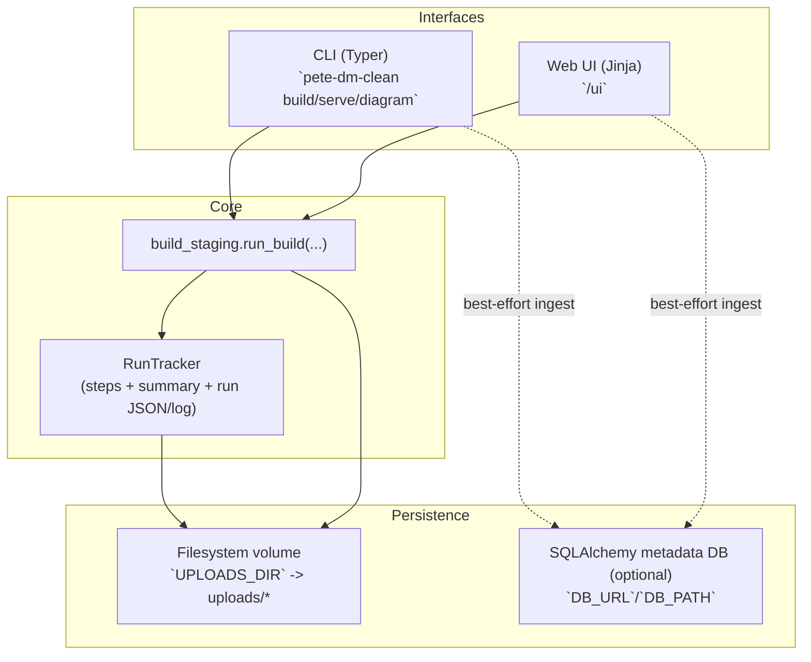

## AI magnifying glass playbook (Acki + Mermaid)

This doc is about **how to work with an AI on this repo** so it:

- reads the **right runtime evidence** first (runs/logs/diagrams/tests),
- makes fewer guesses,
- and changes fewer files incorrectly.

It’s written in the same “how you talk” style (direct, practical, homelab-friendly).

---

### Mental model (what’s “truth” in this repo)

- **Truth of behavior = runtime artifacts** written per-run.
  - `uploads/runs/**/<run_id>.json` (structured run record)
  - `uploads/runs/**/<run_id>.summary.md` (human summary)
  - `uploads/runs/**/<run_id>.log` (Loguru run log)
  - `uploads/flowcharts/**/acki_run_<run_id>*.flow.txt` + `*.summary.md` (diagram “map”)
- **Truth of expectations = tests**
  - `tests/*.py` (unit + integration tests)
  - `uploads/runs/_tests/pytest_latest.loguru.log` (what ran + pass/fail nodeids)
- **Truth of “what the UI does” = server routes + templates**
  - `pete_dm_clean/server.py` (FastAPI endpoints: `/ui/*`, `/download/*`, `/runs/*`, `/diagram/*`)
  - `pete_dm_clean/ui/templates/*.html` (Jinja “frontend”)

DB (SQLAlchemy) is intentionally **metadata-only** and optional. It should never be treated as the source of truth for outputs.

---

### The “don’t randomly open files” rule (how to guide an AI)

When you ask for a change, give the AI **one or more of these**:

- a **run_id** (so it can read the exact run record + diagram)
- a **test nodeid** (so it can go straight to the failing behavior)
- a **route name** (e.g. `/ui/build`, `/download/{run_id}/out_xlsx`)
- a **file path** (if you already know the touchpoint)

This turns “search the repo” into “trace one evidence chain”.

---

### Evidence-first debugging (the workflow you want the AI to follow)

#### 1) Reproduce or identify the failing unit

- If it’s a test failure:
  - Use the failing **nodeid** from `pytest_latest.loguru.log`
- If it’s runtime:
  - Use the **run_id** from the UI “Build complete” page or from `uploads/runs/**`

#### 2) Read the artifacts (before reading code)

For a run:

- `uploads/runs/**/<run_id>.json` (inputs/outputs/steps/summary)
- `uploads/runs/**/<run_id>.summary.md` (high-signal narrative)
- `uploads/flowcharts/**/acki_run_<run_id>.flow.txt` (what happened, in order)

For tests:

- `uploads/runs/_tests/pytest_latest.loguru.log` (COLLECT + PASS/FAIL nodeids)

#### 3) Map evidence → code boundary

Use the evidence to decide which “boundary” is likely at fault:

- **CLI build issue** → `pete_dm_clean/cli.py` and `build_staging.run_build`
- **Web build issue** → `pete_dm_clean/server.py` (`/ui/build`) and `build_staging.run_build`
- **Template/schema issue** → `pete_dm_clean/template_inherit.py` and template file under `uploads/templates/`
- **Company scoping issue** → `pete_dm_clean/companies.py` and server/cli scoping logic
- **Diagram issue** → `pete_dm_clean/diagrams.py` and RunTracker outputs

#### 4) Only then open code (surgically)

Search first (symbols/strings), then open the smallest files that matter.

---

### What “the mapping tool” is (in this repo)

In practice it’s a combo of:

- **RunTracker JSON + summary** (what happened, with steps and metrics)
- **Acki diagrams** (visual ordering + status)
- **Loguru logs** (human-readable detail without drowning the UI)
- **Tests** (expectations that can’t drift silently)

If we “make this huge later”, these are still the right primitives—just with more stations/steps.

---

### Acki-style flow (example)

This is the _kind of runtime story_ the AI should read first (from `uploads/flowcharts/.../*.flow.txt`).

```text
st=>start: run_start
op1=>operation: load_desired (rows/cols)
op2=>operation: load_contacts (rows/cols)
op3=>operation: load_template (cols)
op4=>operation: build_staging (rows)
op5=>operation: write_outputs (xlsx/csv)
op6=>operation: write_reports
e=>end: run_end (OK/WARN/FAIL + reasons)

st->op1->op2->op3->op4->op5->op6->e
```

**How the AI uses it**:

- If it fails at `load_contacts`, don’t touch template code.
- If it fails at `write_outputs`, check filesystem paths/permissions and output naming logic.
- If it WARNs about match rate, check debug metrics thresholds (config) rather than “random fixes”.

---

### Mermaid map (how components relate)



Key idea: **everything important lands on disk**; DB is just an index.

---

### How to talk to the AI (prompt templates)

#### When something “doesn’t work” in the web UI

Good prompt:

> “The web build on `/ui/build` is not randomizing External Ids. Here’s the run*id: `2026-...`. Read `uploads/runs/<run_id>.json` and `uploads/flowcharts/.../acki_run*<run_id>.flow.txt`first, then find the exact parameter mapping in`pete_dm_clean/server.py`.”

Bad prompt:

> “Randomize IDs is broken, fix it.” (forces guessing)

#### When a test fails

Good prompt:

> “Here’s the failing nodeid from `uploads/runs/_tests/pytest_latest.loguru.log`: `tests/test_web_ui_build.py::test_web_ui_build_contacts_only_randomize_external_ids`. Diagnose using the test + route handler it targets.”

#### When you want to confirm what changed in behavior

Good prompt:

> “Compare two run_ids: `<old>` vs `<new>`. Summarize differences in `inputs`, `outputs`, and `summary.generator_settings` from the run JSONs.”

---

### What a “frontend test” means here (important)

This repo does **not** have a separate JS frontend. The “frontend” is:

- **FastAPI routes** + **Jinja templates**

So “frontend testing” is mostly:

- FastAPI integration tests:
  - POST `/ui/build` with form data
  - assert response HTML contains “Build complete”
  - assert outputs exist in the temp uploads dir

If you later add a real browser/JS layer, _then_ you’d add Playwright/Cypress.

---

### How we know our changes are “captured” by the mapper

Whenever we add a new feature flag or behavior, the AI should confirm:

- it appears in the run record (JSON) under `summary.generator_settings` or `inputs`,
- it appears in the diagram/summary narrative (when useful),
- and there’s a test that proves the new behavior for at least one interface (CLI or UI).

Example (External Id randomization):

- Evidence in code path: `randomize_external_ids_enabled`, `external_id_seed`, `external_id_digits`
- Evidence in run JSON: `summary.generator_settings.*`
- Evidence via test: integration test posting `/ui/build`

---

### Scaling this pattern (if the app becomes “huge”)

Keep the same three lenses:

- **Tests** define expected behavior.
- **Run artifacts** define actual behavior.
- **Diagrams** make the run explainable.

Then add:

- stronger “station naming” conventions for RunTracker
- more structured metrics per station (counts, durations, warnings)
- a small “run browser” page (querying DB index) _without moving artifacts into DB_
